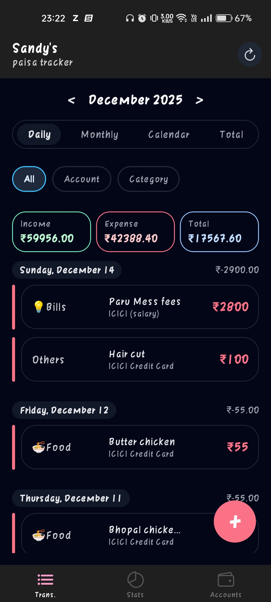
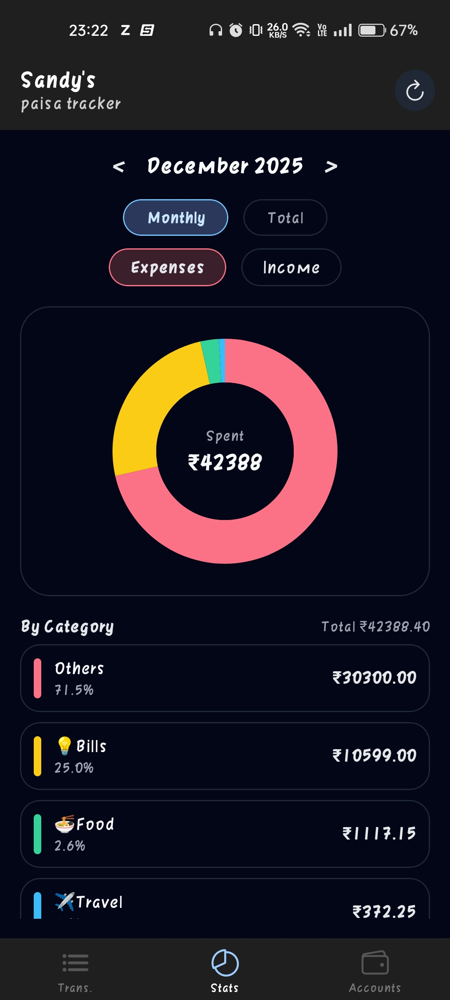
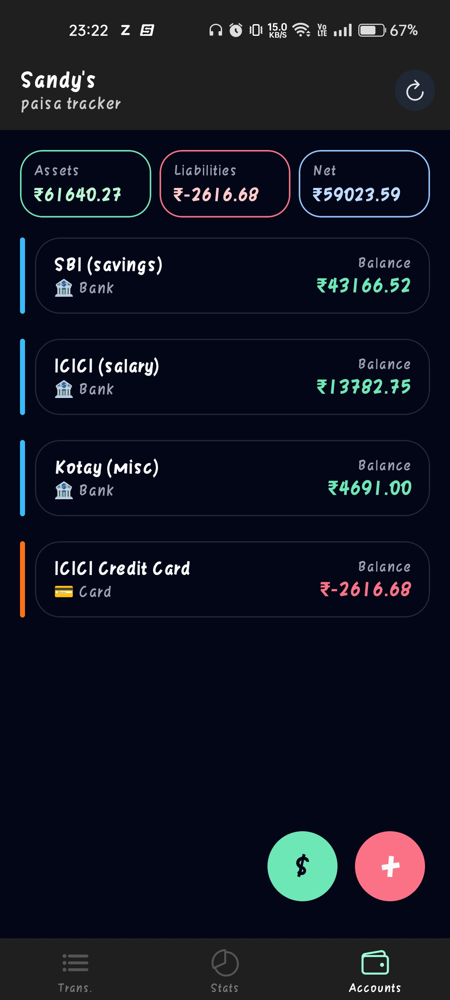
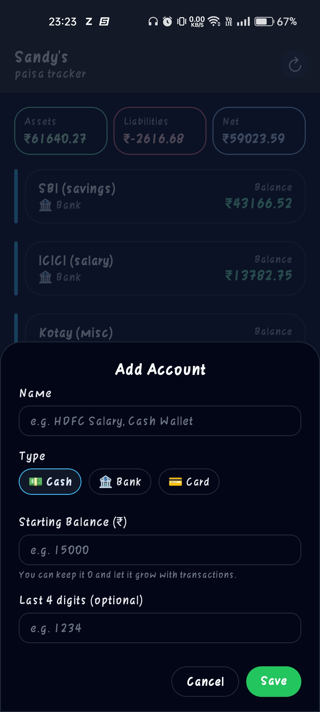

# Budget App 📊

Welcome to the **Budget App**, a modern and intuitive application for managing your finances. This app is built using [Expo](https://expo.dev) and React Native, providing a seamless experience across Android and iOS platforms.

---

## App Screenshots 📸

Here are some screenshots of the app:

| Home Screen | Transactions | Statistics |
|-------------|--------------|------------|
|  |  |  |
| Accounts Page | Add Account | Self Transfer |
|--------------|-------------|---------------|
|  |  |  |

---

## Features ✨

- **Track Expenses and Income**: Categorize your transactions and monitor your financial health.
- **Visual Insights**: Get detailed statistics and charts for better decision-making.
- **Multi-Account Support**: Manage multiple accounts effortlessly.
- **Customizable Categories**: Add and edit categories to suit your needs.
- **Secure and Private**: Your data stays on your device.

---

## Getting Started 🚀

Follow these steps to set up and run the app:

1. **Install Dependencies**:

   ```bash
   npm install
   ```

2. **Start the App**:

   ```bash
   npx expo start
   ```

   You can open the app in:
   - [Development Build](https://docs.expo.dev/develop/development-builds/introduction/)
   - [Android Emulator](https://docs.expo.dev/workflow/android-studio-emulator/)
   - [iOS Simulator](https://docs.expo.dev/workflow/ios-simulator/)
   - [Expo Go](https://expo.dev/go)

3. **Reset the Project** (Optional):

   If you want to start fresh:

   ```bash
   npm run reset-project
   ```

---

## Learn More 📚

To learn more about developing with Expo, check out:

- [Expo Documentation](https://docs.expo.dev/): Comprehensive guides and tutorials.
- [Learn Expo Tutorial](https://docs.expo.dev/tutorial/introduction/): A step-by-step tutorial for beginners.

---

## Community 🌍

Join the Expo community to connect with other developers:

- [Expo on GitHub](https://github.com/expo/expo): Contribute to the platform.
- [Discord Community](https://chat.expo.dev): Ask questions and share knowledge.

---

## License 📜

This project is licensed under the MIT License. See the LICENSE file for details.
